# Adaptive Branch Reasoning Prompting Enhances Literature-based Scientific Reasoning

This repository contains the code implementation and data for the paper titled "Adaptive Branch Reasoning Prompting Enhances Literature-based Scientific Reasoning."

To improve clarity, we updated the README.md with diagrams to clarify the method and input/output examples. We include an example using the Paper Source Tracing (PST) task to further elucidate the methods discussed in the paper.



## Data Preparation

1. Cleaned Paper Source Tracing data is located in `dataset/PST`.
2. Data downloaded from [Huggingface](https://huggingface.co/datasets/allenai/scirepeval/viewer/relish) are placed in `dataset/relish`.
3. The Cora/PubMed datasets can be downloaded from [this link](https://github.com/XiaoxinHe/TAPE).

## Installation

Install the required packages using the following command:

```bash
pip install -r requirement.py
```

## How to Run the Code

### Initialize Task Agent

For classification tasks:

```python
from predata.ClassiAgent import linkInContextAgent
agent = linkInContextAgent()
retr = Retriever(agent)
```

For proximity tasks:

```python
from predata.PromxAgent import PromxAgent
from predata.RELData import RelishData
from predata.PSTdata import PSTData

# PST
pstdata = PSTData()
agent = PromxAgent(pstdata,"pst")
# Relish
reldata = RelishData(False)
agent = PromxAgent(reldata,'relish')
```

### Adaptive Branch-of-Thought

1. Run `adaBoT.py` to perform boosting:

   ```python
   from adaBot import Booster
   # ABoT = Booster(agent, retr) ## for classification tasks
   ABoT = Booster(agent) ## for proximity tasks

   ABoT.Boosting()
   # Output: weak learners with weight: boost_alpha.json
   ```

### Adaptive Branch Reasoning Prompts

1. Generate branch reasoning demonstrations:

```python
from ABRP import PSTRunner

pst_runner = PSTRunner(agent)
pst_runner.generate_BRD_prompts()
# Output: prompts for generating BRD
```

```python

from ABRP import RELRunner

rel_runner = RELRunner(agent)
rel_runner.generate_BRD_prompts()
# Output: prompts for generating BRD
```

```python

from ABRP import ClassRunner

cla_runner = ClassRunner(agent)
cla_runner .create_reason()
# Output: prompts for generating BRD
```

2. Construct ABRP prompts:

```python
pst_runner.ABRP_prompts() # for PST
rel_runner.ABRP_prompts() # for Relish
cla_runner.ABRP_model() # for Classify

```

### Example

Take PST as an example, the input is

```
Determine whether the references  are the source paper of the Query.
Query:  Title: Wide Activation for Efficient and Accurate Image Super-Resolution. Abstract: In this report we demonstrate that with same ... 
Reference-1: Title: Enhanced Deep Residual Networks for Single Image Super-Resolution. Abstract: Recent research on super-resolution has …
Reference Paper-2: Title: Balanced Two-Stage Residual Networks for Image Super-Resolution.  Abstract: In this paper,  balanced two-stage residual networks are proposed …
Reference Paper-3: …
```

Using the adaptive Branch-of-thought, you will obtain different decomposition strategies and their weights:

```python
{"idea+method":0.2, "method+goal":0.1, ...}
```

Running the branch reasoning demonstrations generator module will yield:

```python
(METHOD) Methodology: Assign ’m_score’ 0, 1, 2 to assess whether it adopts or expands the method M introduced in the Reference.
Example: The Query introduces a new framework, Defense-GAN, which leverages generative models, thus adopting the methodology. Consequently, the m_score is 2. However, the other references discuss existing methods and vulnerabilities without proposing a new methodology that the Query adopts. Consequently, the m_score is 0.

(THEORY/EXPER) Theoretical Foundation/Experimental Design: Assign ’e_score’ 0, 1, 2 to evaluate if the Query uses the new theory, experimental design, implementation, or tool proposed by the Reference. 
Example: The Query utilizes the concept of generative models to defend against adversarial attacks, which aligns with the theoretical foundation of the Reference that discusses vulnerabilities in DNNs. Consequently, the e_score is 2. However, the other references provide insights into adversarial sample crafting and defenses but do not directly inspire the Query’s theoretical approach. Consequently, the e_score is 0.
```

Final ABRP prompts example:

```python
Determine whether the references are the source paper of the Query. When reasoning, you should identify the specific aspects and discuss their relationship:
Query: Title: Wide Activation for Efficient and Accurate Image Super-Resolution. Abstract: In this report we demonstrate that with same...
Methodology: Assign a score {0, 1, 2} to assess whether it adopts or expands the method introduced in the Reference.
Example: The Query introduces a new framework, Defense-GAN, which leverages generative models, thus adopting the methodology. Consequently, the score is 2. However, the other references discuss existing methods... Thus, the score is 0.
Idea: Assign A score {0, 1, 2} to evaluate if the Query’s idea, motivation or core concept are inspired by the Reference.
Example: The core idea of the Query is inspired by... attacks on classifiers, which resonates with the findings in the Reference about... Thus, the score is 2. However, the other references do not provide an idea that influences the motivation. Consequently, the score is 0.
```
